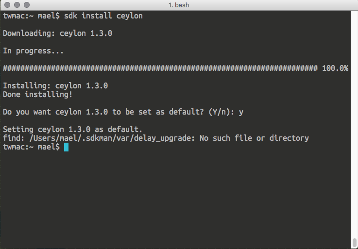

The first pain you feel when starting a new project, of course, is setting up your environment. In my case, I also had to learn a new operating system because I never had an Apple computer before.

Now, many things change between Linux and macOS but I still had a lot of things to learn before setting up a Ceylon + Spring Boot environment correctly. In the following paragraphs, I will explain you what I did and I hope you can reproduce it on your own to work with these two awesome technologies.

### iTerm2, replacement terminal for macOS

By recommendation I started downloading [iTerm2](https://iterm2.com/). The installation is very straightforward: click in the download button to get the zip file, then double click it in your Finder to extract the content, a single .app file (that is a “Package bundle”) and execute it.


One good thing that I found from iTerm2 is the so called “Unyxness” i.e. it has a lot of shortcuts to avoid using my mouse while in the console. I also enjoyed the [Material Design](https://material.google.com/) theme that matches my other application themes (I will talk about those later).

### Homebrew, because you need a package manager


Having a good terminal emulator will allow you to install [Homebrew](http://brew.sh/). Homebrew is a package manager for macOS that will allow you to install third party packages from the console. Among the packages needed will be Java but I will talk about that later.

To install Homebrew just insert this command in iTerm2 and follow the instructions:

```
$ /usr/bin/ruby -e "$(curl -fsSL https://raw.githubusercontent.com/Homebrew/install/master/install)"
```

Now, Homebrew has a plethora of software that you can install but first you should check that everything is running fine and you have the package definitions up to date. You can do that with the following commands:

```
$ brew update
$ brew doctor
```

Once you see if everything is working fine, you can continue with installing Java.

### Tooling Needed: Java 8, SDKMAN!, Ceylon and Gradle

To install Java 8 you need to run the following command:

```
$ brew cask install java
```

And to make sure that you have it up and running just run a command to get the version you are running currently:

```
$ java -version
java version "1.8.0_112"
Java(TM) SE Runtime Environment (build 1.8.0_112-b16)
Java HotSpot(TM) 64-Bit Server VM (build 25.112-b16, mixed mode)
```

Now, before you install Ceylon you will need to install yet another tool called [SDKMAN!.](http://sdkman.io/) It will allow to install and manage different versions of Ceylon (among other things!).

The setup is pretty straightforward, just type this in your terminal and follow the instructions:

```
$ curl -s "https://get.sdkman.io" | bash
```

You will have to close the current terminal session and then you will have SDKMAN! working properly.

To know that you have it working correctly, check the list of candidates that you can install, among those you will see Ceylon:

```
$ sdk list
```

As you can see in the image, you have a list of candidates that you can install and SDKMAN! will show you the way to install those and the latest version. In this case, to install Ceylon, you have to type the following command:

```
$ sdk install ceylon
```

If you have to install a specific version of any candidate, just add the version as another parameter to the command e.g. `sdk install ceylon 1.2.2` . To see the list of available versions you can type `sdk list ceylon`



How to check that Ceylon is working fine? Just check the current version:

```
$ ceylon --version
ceylon version 1.3.0 49375fd (Total Internal Reflection)
```

Now that you have Ceylon, you will want to install Gradle (I will tell you why in the next section) using SDKMAN!. You also want to check that everything works as expected.

```
$ sdk install gradle
...
$ gradle --version

------------------------------------------------------------
Gradle 3.1
------------------------------------------------------------

Build time:   2016-09-19 10:53:53 UTC
Revision:     13f38ba699afd86d7cdc4ed8fd7dd3960c0b1f97

Groovy:       2.4.7
Ant:          Apache Ant(TM) version 1.9.6 compiled on June 29 2015
JVM:          1.8.0_112 (Oracle Corporation 25.112-b16)
OS:           Mac OS X 10.12.1 x86_64
```

### Gradle, Ceylon and Managing Transitive Depedencies

Let me explain something here. I have been working in two Ceylon projects so far. One of those projects is very small and does not depend much on external libraries. On the other hand, I have an application that started just like that and I had to add different features until I finally decided to add Spring to it.

Because Ceylon modules do not handle transitive dependencies, I had to create a module descriptor with all the dependencies needed. It looked like this:

<Embed src="https://gist.github.com/ElderMael/e884f74f7be89e33d88511e5bcaf36a3.js" aspectRatio={0.357} caption="" />

As you can see, managing all the dependencies like this will be a burden if you start adding more libraries/modules like I had to. This is why you need Gradle and Renato Athaydes’ Ceylon plugin for Gradle.

[**renatoathaydes/ceylon-gradle-plugin**  
_ceylon-gradle-plugin - A simple Gradle plugin to manage Ceylon projects._github.com](https://github.com/renatoathaydes/ceylon-gradle-plugin "https://github.com/renatoathaydes/ceylon-gradle-plugin")[](https://github.com/renatoathaydes/ceylon-gradle-plugin)

What this plugin will do is to manage your module transitive dependencies by creating an `overrides.xml` file that will tell Ceylon that you will also need more dependencies than the ones declared in your module (to know how this file works, refer to the Ceylon help located [here](https://ceylon-lang.org/documentation/1.3/reference/repository/overrides/)).

### Creating a Ceylon Project and Building with Gradle

To create a Ceylon project you can use the command line to create the files for a new Ceylon module. You only have to type the following command and enter the required parameters so the Ceylon command line tool can generate the project structure for you.

```
$ ceylon new simple
```

And this is where Gradle comes into play. First you will need to create a file named `build.gradle` and provide the contents needed to work with your module so the Ceylon plugin can create the overrides.xml file.

Here is how my `build.gradle` file looks like for the module I created with the command line:

<Embed src="https://gist.github.com/ElderMael/e5e2bd737659fdfe393b320656846b0e.js" aspectRatio={0.357} caption="" />

This is pretty simple, you just declare the plugin for Gradle to use. Afterwards you need to make sure that the ceylon groovy closure contains the module that you specified in the command line and finally you provide the repository from which the dependencies will be retrieved (in this case, jcenter).

> NOTE: The dependency block is to exclude logback from your dependencies as it is already contained within Ceylon. If you do not exclude this, you will get an error when trying to run the spring boot application.

For Spring Boot, you will need to declare only the starter poms as dependencies and then the plugin will take care of the rest. Here is how my `modules.ceylon` and run.ceylon files look like:

<Embed src="https://gist.github.com/ElderMael/8999506e0bba0b64a8cebff31f082ac9.js" aspectRatio={0.357} caption="" />

With this project structure, you have all you need to let Gradle build and run your application. Execute the following command:

```
$ gradle runCeylon
```

The first time you can see that Gradle will download all the direct and transitive dependencies for your project and finally it will run our application embedded server listening to the port 8080.

```
$ gradle runCeylon
':resolveCeylonDependencies
:createDependenciesPoms UP-TO-DATE
:createMavenRepo UP-TO-DATE
:generateOverridesFile UP-TO-DATE
:createModuleDescriptors UP-TO-DATE
:importJars UP-TO-DATE
:compileCeylon UP-TO-DATE
:runCeylon

.   ____          _            __ _ _
 /\\ / ___'_ __ _ _(_)_ __  __ _ \ \ \ \
( ( )\___ | '_ | '_| | '_ \/ _` | \ \ \ \
 \\/  ___)| |_)| | | | | || (_| |  ) ) ) )
  '  |____| .__|_| |_|_| |_\__, | / / / /
 =========|_|==============|___/=/_/_/_/
 :: Spring Boot ::        (v1.3.0.RELEASE)

1012 [main] INFO io.eldermael.ceylon.boot.run_ - Starting run_ on twmac.local with PID 70615 

...

3628 [main] INFO org.springframework.boot.context.embedded.tomcat.TomcatEmbeddedServletContainer - Tomcat started on port(s): 8080 (http)
3634 [main] INFO io.eldermael.ceylon.boot.run_ - Started run_ in 2.99 seconds (JVM running for 4.104)
> Building 87% > :runCeylon
```

Now, you can always stop the execution by pressing Ctrl + C but unfortunately this won’t stop the servlet container thus you will need to kill the process using the PID manually, e.g.

```
$ kill -9 70615
```

### Import to Intellij IDEA

Because I do not expect you to edit more files in the command line with nano (worst, Vim), you will need to download Intellij Idea and get the Ceylon plugin that will help you to edit Ceylon files with nice features such as autocompletion and refactoring.

First, you need to download any version of Intellij Idea (I use the community edition):

[**IntelliJ IDEA the Java IDE**  
_Code-centric IDE, focused on your productivity. Full Java EE support, deep code understanding, best debugger…_www.jetbrains.com](http://www.jetbrains.com/idea/#chooseYourEdition "http://www.jetbrains.com/idea/#chooseYourEdition")[](http://www.jetbrains.com/idea/#chooseYourEdition)

Once you have installed it by double clicking in the file, you have to run the IDE for the first time. What you need to do to get the Ceylon plugin is to select the plugin option in the Configure menu at the welcome screeen.


Afterwards, in the next dialog, you have to click in the Browse repositories button and it will show you a dialog box where you can search for the Ceylon IDE plugin and install it.


Once you have downloaded the plugin and restarted the IDE you can now import the project we created beforehand.

Note that it is important that you “import” import the project from the Welcome screen instead of selecting “Open” or “Create New Project” otherwise the project dependencies and autocompletion won’t work (in my experience).

To import the project you need to select the root folder as shown in the image.


Then you will be prompted with a dialog to import the project and you have to select the option “Import project from existing sources”. Following that you will have a screen where most of the options by default are OK unless you want to customize how the gradle project will be imported (I recommend to use the default gradle wrapper here).

Also you will be prompted to select the options for the “Project structure” and thus the Ceylon compiler options. You will se a tab called “Repositores”. There you have to select the overrides.xml file that Gradle creates in the building process so Ceylon can import the libraries that you specify and detect the transitory dependencies. You also have to check both options “Use a flat classpath” (unless you have specified otherwise in the Gradle plugin) and “Automatically export Maven dependencies”. This is very important, this way the IDE can autocomplete


You will know that your project is correctly imported once you can see that the transitive dependencies are shown in “External libraries” node of the project toolbar.


Unfortunately at this point, Gradle will crash if you do not have tests. Until you write tests your only option will be to run every Gradle command skipping tests using the option `-x test` e.g. `gradle runCeylon -x test`

To see a proper way to test your Ceylon modules, you can follow [this guide](https://ceylon-lang.org/blog/2016/02/22/ceylon-test-new-and-noteworthy/). The recommendation is that you create a module prefixed with `test` that will contain the tests of the module with production code. E.g., if you have a module named `foo.bar` then your test module will be named `test.foo.bar`

### Wrapping up

I document this because it was a lengthy back and forth to setup this environment but it was worth as now I have all what I need to continue with this project. I hope this will be useful in the future but I am more interested in the future Spring Boot integration promised by Gavin King.


